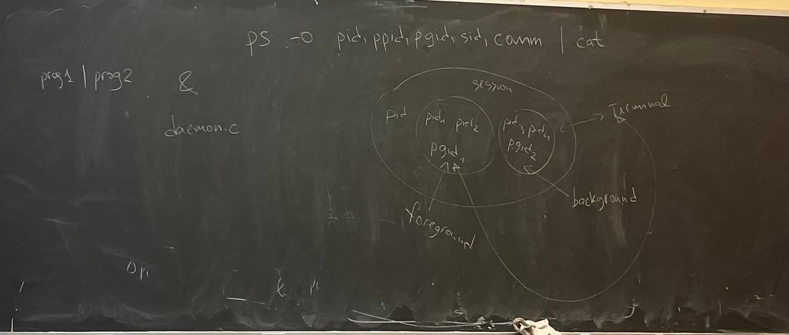

При запуске терминала создается новая сессия

prog1 | prog2 &

ps -o pid,ppid,pgid,sid,comm | cat

cat - катирация всех файлов на стандартный вывод
ps - для процессов
pgid - id группы

ps - вывдит все процессы 
   -j - с доп колонками
   -x  - процессы которые не прикрепленны к терминалу (отключен)
